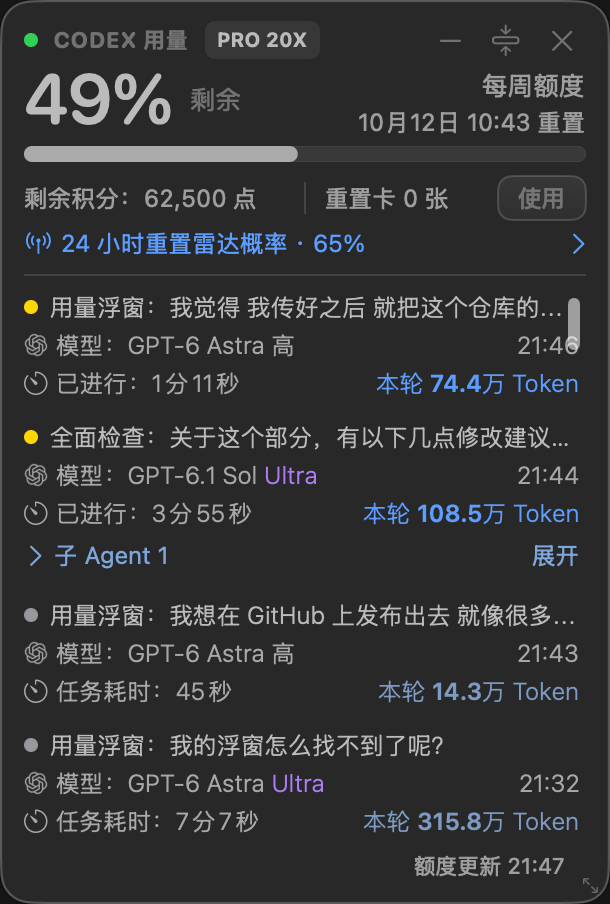
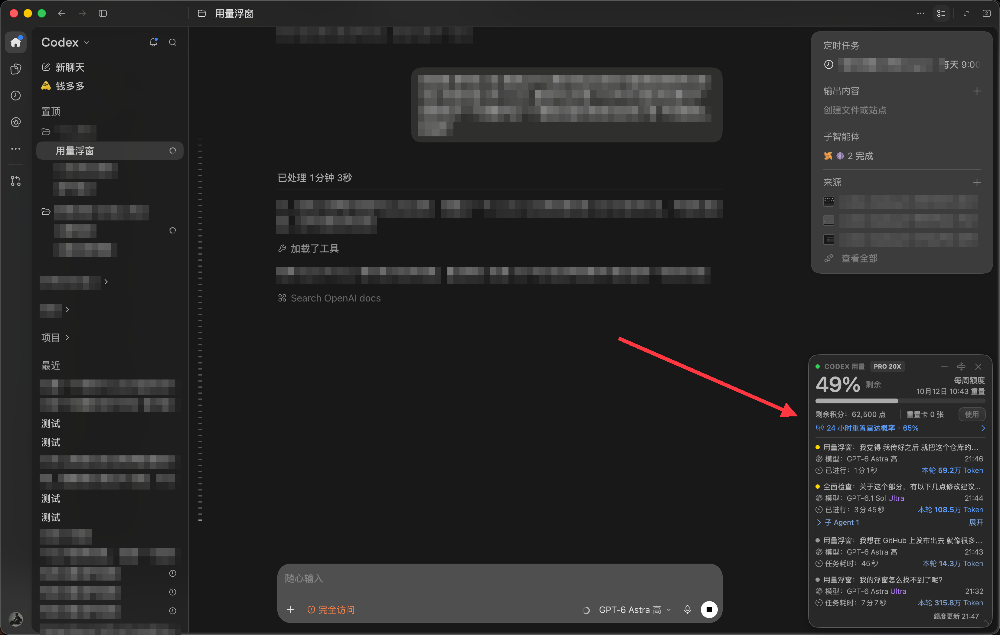
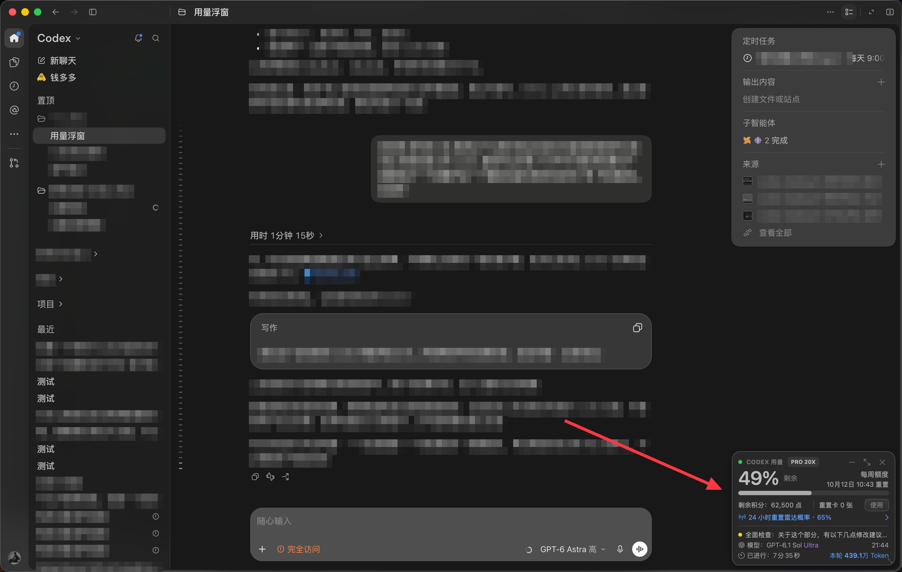
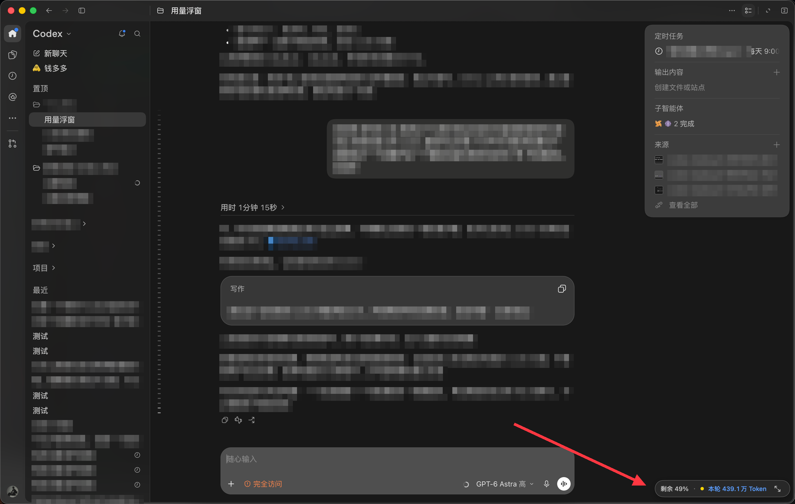

# Codex Usage Widget｜Codex 用量小窗

[简体中文](README.md) | [English](README.en.md)

Watch the current task's usage while you work in Codex chat, without switching windows

A small macOS overlay for per-turn Token usage, child-agent usage and remaining quota, designed to sit alongside the Codex chat interface and hide when you leave it

This is an independent, unofficial tool, not an OpenAI product or an embedded Codex extension — it does not modify the official app

## Install with Codex

Send this to Codex on your Mac:

> Install the Codex Usage Widget skill from https://github.com/qq750129414-sketch/codex-usage-widget and follow SKILL.md to install and launch the widget

Codex checks your environment and builds the app from the bundled source, so you do not need to copy commands or download a ZIP first

**Mac only — requires a signed-in Codex desktop app, a compatible Codex CLI, Python 3 and Xcode Command Line Tools**

The current build was verified on macOS 26.4.1, not on every macOS version or a clean second Mac
Documentation is available in Chinese and English, but the widget UI is currently Chinese
The installed app name remains `Codex用量浮窗`

### Accessibility permission

Allow `Codex用量浮窗` in **System Settings → Privacy & Security → Accessibility**, or use the menu bar's **◉ 用量 → 授权聊天页识别…** entry

This permission is used to recognize chat pages, not to read input-field text or operate the chat
Without permission, the menu bar and backend may run while the overlay remains hidden
Rebuilding the app can require renewed authorization — do not launch duplicate instances to troubleshoot this

## Features

- Remaining quota, reset time, credit balance and available reset cards
- Token usage for the current turn rather than the entire conversation total
- Expandable child agents under their parent task, with usage included when attribution to the current turn is known
- Drag to move and resize
- Quota update time at the bottom left; the bottom-right position button restores default placement while keeping the current size
- Finished or stopped tasks are slightly faded as a whole, making running tasks easier to spot
- Three forms: expanded task list, compact single task and a minimized strip
- Running tasks first, newest start time first when several are running; otherwise the latest task
- Automatically hide in settings, outside chat pages and when switching away from Codex

| Expanded | Compact | Minimized |
| --- | --- | --- |
|  |  |  |

Screenshot balances, tasks and dates are examples, not values hard-coded into the app
Screenshots show an earlier build; the latest version updates the footer layout and adds a position-reset button and faded finished tasks

## Optional reset radar

To show the estimated probability of a reset within 24 hours, search WeChat for the **重置雷达** mini program and obtain your own API Key through its current process, then ask Codex to help configure it

This optional integration uses the third-party service `api.tangka.online` — it is not an OpenAI prediction, does not guarantee a reset for your account and does not reset your quota automatically

Basic quota and task-usage features work without it
Enter your key locally when prompted and store it in macOS Keychain, not in chats, screenshots or GitHub
The service's current access terms and fees apply; this project does not include a key

## Plan labels

The app reads the signed-in account's plan type and applies these project-specific display labels:

| Plan | Display label |
| --- | --- |
| Plus | Plus 1X |
| Pro 100 | PRO 10X |
| Pro 200 | PRO 20X |
| Pro 500 | PRO 25X |

**X is a display convention, not a live quota multiplier returned by the service, and is never used to calculate quota or Token usage**
Other plan types keep their actual type; missing data is shown as unknown rather than assumed to be Pro

## Privacy and limitations

- Usage accounting separately reads local Codex session logs and task metadata, and stores private usage records under the installation directory — take care when sharing task titles
- Per-turn Token includes processed input, cached input and output across model calls, not just newly generated text or a credits bill; cloud tasks, other machines and missing logs may be incomplete
- A reset card is consumed only after you click Use and confirm; no card can be used when the count is zero
- Closing the overlay hides it; reopen from the menu bar, or use the menu's Quit action to stop the backend
- Codex updates may change APIs, log formats or page recognition; ongoing compatibility is not guaranteed
- Edge hover resize cursors have a known limitation on non-activating windows

Installation and maintenance guidance: [SKILL.md](SKILL.md) and [behavior and compatibility notes](references/behavior-and-compatibility.md) — these technical instructions are currently in Chinese

Project code is provided under the [MIT license](LICENSE); see [third-party notices](THIRD_PARTY_NOTICES.md) for screenshots and branding
